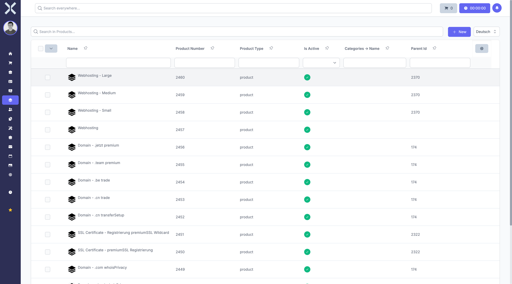

# Manage Products

The product list shows your entire product catalogue.

## Open the Product List

1. Click **Products** in the sidebar, then **Products**.

   

2. The table shows all products with the following columns:
   - **Product Number** - Unique item number
   - **Name** - Product name
   - **Description** - Short description
   - **Price** - Selling price
   - **Is Active** - Product status (active/inactive)

## Search Products

Use the search field above the table to search products by name, number or description.

## Create a New Product

1. Click **New** in the top right corner.
2. Fill in the product data (name, number, price, etc.).
3. Click **Save**.

## Related Topics

- [Serial Numbers](2-serial-numbers.md) - Manage serial numbers for products
- [Orders](../4-orders/0-index.md) - Use products in orders
