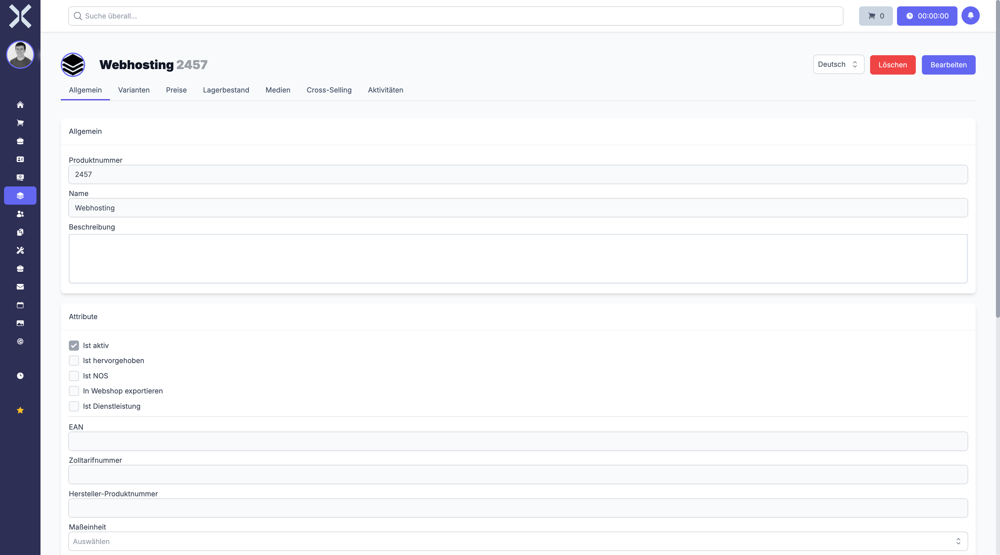

# Product Details

The detail view shows all information for a single product.

## Open the Detail View

1. Navigate to the [product list](1-manage-products.md).
2. Click on the desired product.

   

## Tabs

The detail view is divided into several tabs:

### General

The **General** tab contains the basic product data:

- **Product Number** - Unique article number
- **Name** - Product name
- **Description** - Detailed product description

#### Attributes

- **Is Active** - Product is available for use
- **Is Highlighted** - Product is highlighted in listings
- **Is NOS** - Never-out-of-stock product
- **Export to Webshop** - Product is exported to the webshop
- **Is Service** - Product is a service rather than a physical item

#### Additional Fields

- **EAN** - European Article Number (barcode)
- **Customs Tariff Number** - Number for customs declarations
- **Manufacturer Product Number** - Manufacturer's own article number
- **Unit of Measure** - Unit used for the product

### Variants

Manage product variants (e.g. different sizes or colours).

### Prices

View and edit pricing information for the product.

### Stock

Current stock levels and warehouse information.

### Media

Attached images and files for the product.

### Cross-Selling

Configure cross-selling products that are suggested alongside this product.

### Activities

History of changes and events related to the product.

## Actions

- **Edit** - Click **Edit** to make changes to the product data.
- **Delete** - Remove the product.
- **Language** - Switch the display language for the product data.

## Related Topics

- [Manage Products](1-manage-products.md) - Back to the product list
- [Orders](../4-orders/0-index.md) - Use products in orders
