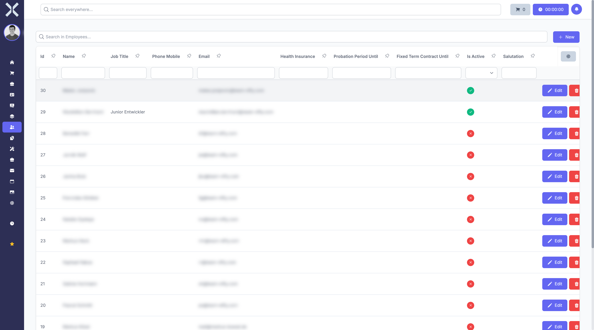

# Human Resources

In the **Human Resources** module you manage employees, working hours, absences and more.

## Overview

Navigate to **Human Resources** via the sidebar. The submenu contains the following areas:

- **My Employee Profile** - View and edit your own employee profile
- **Dashboard** - Overview of HR key figures
- **Attendance Overview** - Daily attendance of all employees
- **Employees** - Employee list and management
- **Employee Days** - Overview of working days
- **Working Hours** - Recorded working hours of all employees
- **Absence Requests** - Manage vacation and absence requests

## Employee List

The employee overview shows all employees in a tabular view.

The table contains the following columns:

- **ID** - Unique employee ID
- **Name** - First and last name
- **Job Title** - Position in the company
- **Mobile Phone** - Mobile number
- **Email** - Email address
- **Health Insurance** - Registered health insurance
- **Probation Until** - End of probation period
- **Fixed-term Contract Until** - Contract end date for fixed-term contracts
- **Is Active** - Active employee (green) or inactive (red)

## Features

- **Search** - Search the employee list by name or other criteria.
- **New Employee** - Click **New** to create a new employee.
- **Edit** - Click **Edit** to modify an employee's data.

## Pages in this Chapter

- [My Employee Profile](1-my-employee-profile.md) - View your own profile
- [Dashboard](2-dashboard.md) - HR dashboard
- [Attendance Overview](3-attendance.md) - Daily attendance status
- [Employees](4-employees.md) - Manage the employee list
- [Working Hours](5-working-hours.md) - Recorded working hours
- [Absence Requests](6-absence-requests.md) - Holiday and absence requests
- [Employee Details](7-employee-detail.md) - Detail view of an employee
- [Employee Days](8-employee-days.md) - Daily working hour summaries
- [Absence Request Details](9-absence-request-detail.md) - Detail view of an absence request
