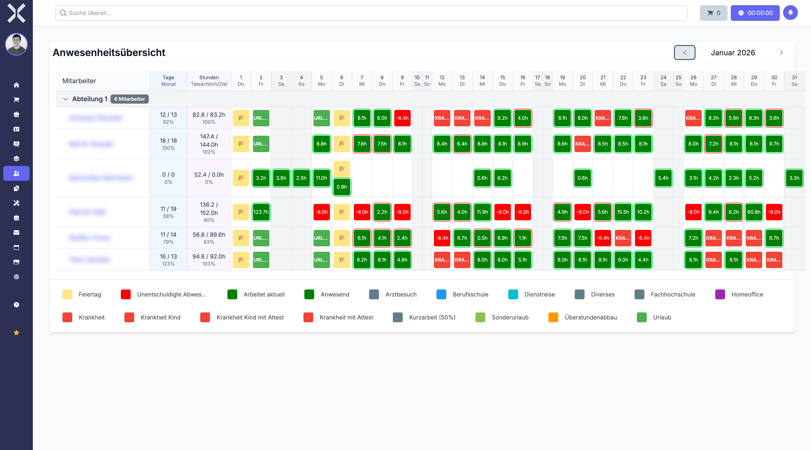

# Attendance Overview

The attendance overview shows the daily attendance status of all employees.

## Open the Overview

1. Navigate to **Human Resources > Attendance Overview**.

   

2. You can see at a glance which employees are present, absent or on leave today.

## Related Topics

- [Employees](4-employees.md) - Manage the employee list
- [Absence Requests](6-absence-requests.md) - Manage absences
