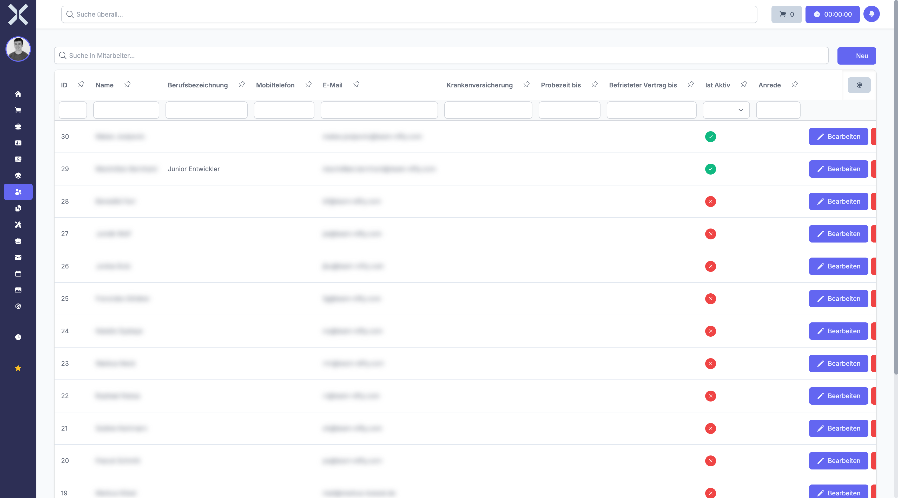

# Employees

The employee list allows you to manage all employees of your company.

## Open the Employee List

1. Navigate to **Human Resources > Employees**.

   

2. The table shows all employees with the following columns:
   - **ID** - Unique employee ID
   - **Name** - First and last name
   - **Job Title** - Position in the company
   - **Mobile** - Mobile phone number
   - **Email** - Email address
   - **Is Active** - Status (active/inactive)

## Search Employees

Use the search field to find employees by name or other criteria.

## Create a New Employee

1. Click **New**.
2. Fill in the employee data.
3. Click **Save**.

## Related Topics

- [Working Hours](5-working-hours.md) - View employee working hours
- [Human Resources](0-index.md) - Back to the overview
