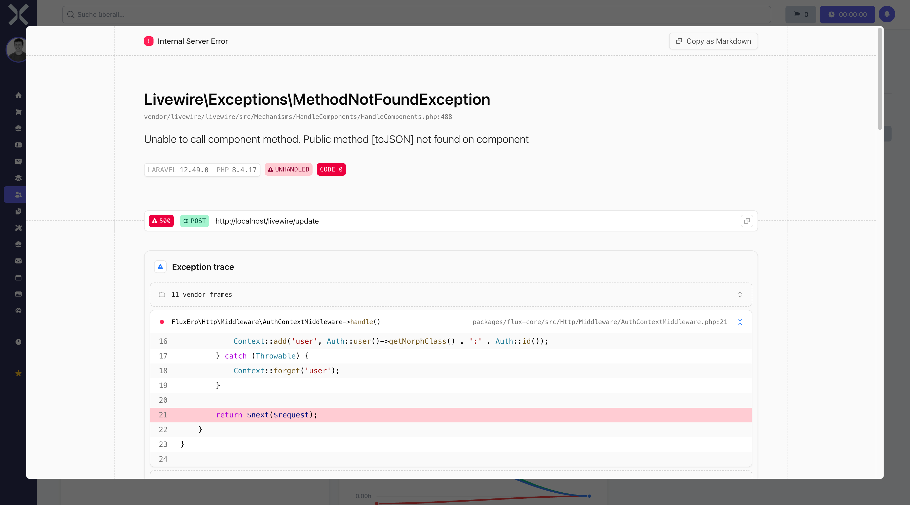

# Employee Details

The detail view shows all information for a single employee.

## Open the Detail View

1. Navigate to the [employee list](4-employees.md).
2. Click on the desired employee.

   

## Sections

### Master Data

The master data section contains the basic employee information:

- **Name** - First and last name
- **Job Title** - Position in the company
- **Email** - Email address
- **Mobile** - Mobile phone number
- **Health Insurance** - Registered health insurance
- **Probation Until** - End of probation period
- **Fixed-term Contract Until** - Contract end date

### Contracts

Overview of all employment contracts for this employee.

### Documents

Attached files and documents (e.g. contracts, certificates).

### Working Hours

Recorded working hours for this employee.

### Absence Requests

Overview of holiday and absence requests for this employee.

## Edit an Employee

1. Change the desired fields directly in the detail view.
2. Click **Save** to apply the changes.

## Related Topics

- [Employees](4-employees.md) - Back to the employee list
- [Working Hours](5-working-hours.md) - View all working hours
- [Absence Requests](6-absence-requests.md) - Manage absence requests
