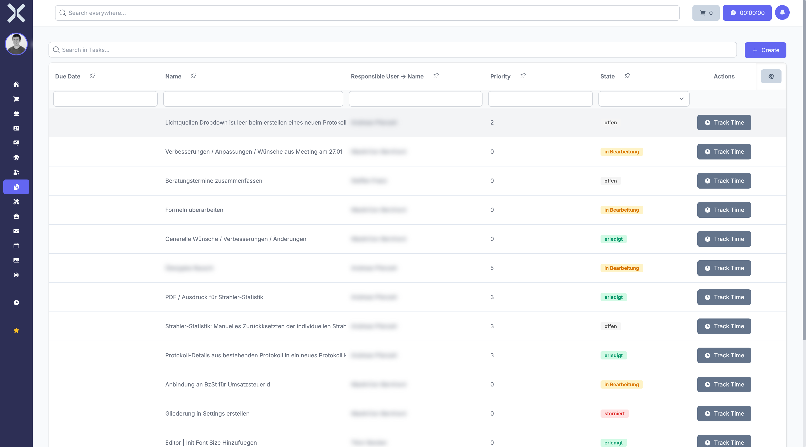

# Tasks

In the **Tasks** module you manage your tasks and track progress.

## Overview

Navigate to **Tasks** via the sidebar. You will see a tabular overview of all tasks.

The table contains typical columns such as:

- **Name** - Task name
- **Description** - Detailed description
- **Priority** - Urgency level
- **Status** - Current processing state (e.g. open, in progress, completed)
- **Assigned To** - Responsible person
- **Project** - Associated project
- **Due Date** - Due date

## Features

- **Search** - Search tasks by name, description or responsible person.
- **Saved Filters** - Use predefined filters for frequent queries.
- **New Task** - Click **New** to create a new task.
- **Time Tracking** - Start time tracking directly from the task list via the **Time Tracking** button.

## Pages in this Chapter

- [Manage Tasks](1-manage-tasks.md) - Task list, search and filters
- [Task Details](2-task-detail.md) - Detail view of a task

## Related Topics

- [Projects](../10-projects/0-index.md) - Manage projects that tasks are assigned to
- [Tickets](../9-tickets/0-index.md) - Handle support tickets
