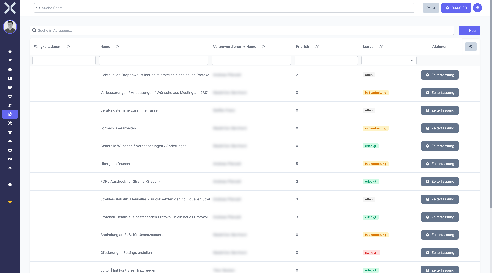

# Manage Tasks

The task list shows all tasks with their status and responsibilities.

## Open the Task List

1. Click **Tasks** in the sidebar.

   

2. The table shows all tasks with the following columns:
   - **Name** - Task name
   - **Priority** - Urgency level
   - **Status** - Current processing status
   - **Assigned To** - Responsible person
   - **Project** - Associated project
   - **Due Date** - Due date

## Filter Tasks

- Use the search field to find tasks by name or description.
- Use **Saved Filters** for frequently used filter settings.

## Create a New Task

1. Click **New**.
2. Enter the name and description.
3. Assign the task to an employee.
4. Set priority and due date.
5. Click **Save**.

## Time Tracking

Click the **Time Tracking** button in the task list to start time tracking for a task directly.

## Related Topics

- [Task Details](2-task-detail.md) - View a single task in detail
- [Projects](../10-projects/0-index.md) - Manage projects
