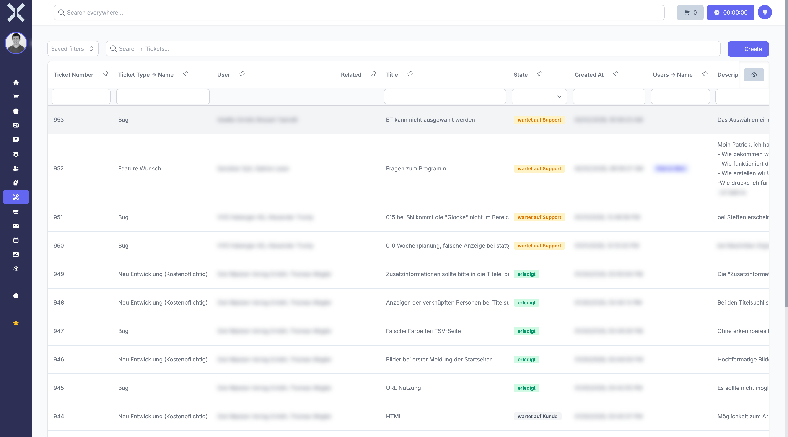

# Tickets

In the **Tickets** module you handle support requests and track their status.

## Overview

Navigate to **Tickets** via the sidebar. You will see a tabular overview of all tickets.

The table contains the following columns:

- **Ticket Number** - Unique ticket number
- **Ticket Type** - Type of ticket (e.g. bug, feature request, new development)
- **User** - Contact and person who created the ticket
- **Related** - Linked records
- **Title** - Subject of the ticket
- **Status** - Current processing status:
  - **waiting for support** - Ticket is waiting to be handled by the team
  - **waiting for customer** - Feedback from the customer is required
  - **in progress** - Ticket is actively being worked on
  - **done** - Ticket has been completed
  - **closed** - Ticket is closed
  - **Escalated** - Ticket has been escalated
- **Created At** - Creation date of the ticket
- **Description** - Content of the request

## Features

- **Search** - Search tickets by title, ticket number or description.
- **Saved Filters** - Use predefined filters (e.g. open tickets, my tickets).
- **Status Filter** - Filter tickets directly via the dropdown menu in the status column.
- **New Ticket** - Click **New** to create a new ticket.
- **Time Tracking** - Start time tracking directly from the ticket list via the **Time Tracking** button.

## Pages in this Chapter

- [Manage Tickets](1-manage-tickets.md) - Ticket list, search and filters
- [Ticket Details](2-ticket-detail.md) - Detail view of a ticket

## Related Topics

- [Tasks](../8-tasks/0-index.md) - Handle tasks related to tickets
